# 📚 Programación Backend II: Diseño y Arquitectura Backend

Este curso está orientado a desarrollar habilidades avanzadas en el diseño y la construcción de aplicaciones backend robustas, escalables y seguras. A lo largo del programa, se profundiza en aspectos clave del desarrollo backend moderno, como la gestión de sesiones y autenticación, el uso de arquitecturas por capas, la separación de responsabilidades, la persistencia de datos y la implementación de servidores web completos.

---

## 🔍 Objetivos del curso

- Entender y aplicar conceptos avanzados de programación backend.
- Diseñar arquitecturas modulares y escalables.
- Implementar mecanismos de autenticación y autorización.
- Trabajar con procesos globales y secundarios en servidores.
- Aplicar buenas prácticas en el desarrollo backend profesional.
- Desarrollar un proyecto final integrador basado en las herramientas y patrones aprendidos.

---

## 🛠️ Contenidos principales

- Express + MongoDB
- Cookies, Sessions y Local Storage
- Autenticación y Autorización (incluyendo JWT y Passport)
- Arquitectura por capas y principios de diseño
- Desarrollo de servidores robustos con Node.js
- Persistencia de datos y servicios de mensajería
- Proyecto integrador final

---

## 📦 Modalidad práctica

El curso combina clases teóricas, desafíos prácticos, after classes de profundización y un proyecto final que permite aplicar los conceptos aprendidos en un entorno real de desarrollo.

---

## 🚀 Proyecto Final

El curso culmina con el desarrollo completo de un servidor backend estructurado, aplicando arquitectura por capas, estrategias de autenticación, manejo de procesos, mensajería y servicios complementarios como mailing.

## Flujo modulos

```mermaid
graph TD

  classDef modulo fill:#786fa6,stroke:#2196f3,stroke-width:2px;
  classDef final fill:#ea8685,stroke:#f7d794,stroke-width:2px;
  classDef recurso fill:#303952,stroke:#f7d794,stroke-width:2px,font-style:italic;
  classDef titulo fill:#1e88e5,color:#ffffff,stroke:#0d47a1,stroke-width:2px,font-weight:bold;

  Estudiante((Estudiante)) --> A[Presentación y WarmUp]

  %% Módulo 1
  T1([📘 Módulo 1: Fundamentos Técnicos]):::titulo
  A --> B[Clase 0:<br>Express + MongoDB]
  B --> C[Clase 1:<br>Cookies, Sessions y Storages]
  C --> D[Clase 2:<br>Cookies, Sessions y Storages II]
  D --> E[Clase 3:<br>Autorización y Autenticación]
  E --> F[Clase 4:<br>Auth por terceros + JWT]
  F --> G[Clase 5:<br>Práctica Integradora]
  T1 --> B

  %% Módulo 2
  T2([🔐 Módulo 2: Seguridad y Ruteo]):::titulo
  G --> H[Clase 6:<br>Passport Avanzado]
  H --> I[Clase 7:<br>Ruteo avanzado<br>y autorización]
  T2 --> H

  %% Módulo 3
  T3([🏗️ Módulo 3: Diseño y Arquitectura]):::titulo
  I --> J[Pre-entrega<br>Proyecto Final]
  J --> K[Clase 8:<br>Proceso principal<br>+ Global/Child Process]
  K --> L[Clase 9:<br>Arquitectura por capas]
  L --> M[Clase 10:<br>Arquitectura del servidor - Diseño]
  M --> N[Clase 11:<br>Persistencia de datos]
  N --> O[Clase 12:<br>Servidor basado en capas]
  O --> P[Clase 13:<br>Mailing y Mensajería]
  P --> Q[Entrega Final<br>Proyecto]
  T3 --> J



  %% Estilos
  class B,C,D,E,F,G,H,I,J,K,L,M,N,O,P modulo;
  class Q final;
  class RC1,RC2 recurso;
```

